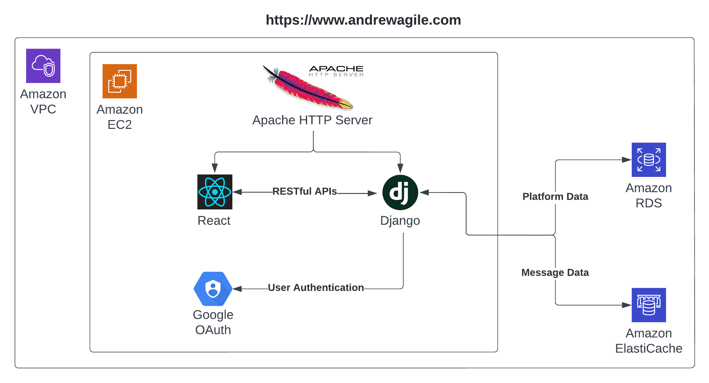

# AndrewAgile

## Overview

A web application serves as an agile platform, with similar functionalities as Jira and Trello.

**Tech stack: Django, React, Material UI, MySQL, Redis, AWS, Google OAuth**

**[Explore our demo website!](https://www.andrewagile.com/)**

## Tech design



## Documentation

[User manual](frontend/src/UserManual.md)

[Deployment guide](backend/Deployment.md)

[Backend API spec](backend/README.md)

## Prerequisites

Suggested dependency versions, can be slightly different.

+ Python 3.8+
  + django 4.0+
  + social-auth-app-django 5.0.x
  + djangorestframework 3.13.x
  + redis-py 4.2.x
  
+ Node.js 17.6+
+ npm 8.5+
+ Redis 6.2+

## Get started

1. Refer to [Google OAuth2 guide](backend/Deployment.md#google-oauth2), register another OAuth client for your local dev environment.

   "Authorized redirect URIs": `http://localhost:8000/oauth/complete/google-oauth2/`
   
   Then add the generated client ID and secret in [config.ini.sample](backend/config.ini.sample#L10)

2. Start the local Redis server. Use the command line interface if needed.

   ```shell
   redis-server
   # redis-cli
   ```

3. Initialize the backend database, rerun if models are changed.

   ```shell
   cd backend
   python3 manage.py makemigrations agileapp
   python3 manage.py migrate
   python3 manage.py shell < agileapp/init_db.py
   ```

4. Start the backend server, code changes will trigger reload.

   ```shell
   cd backend
   python3 manage.py runserver
   ```

5. Install frontend node packages. Then start the frontend app, code changes will trigger reload.

   ```shell
   cd frontend
   npm install
   npm start
   ```

6. Open browser at http://localhost:3000/ to develop and test.

> Note: If you are logged out at localhost:3000, please go to localhost:8000 to login again.
>
> Then return to localhost:3000 for frontend development.

